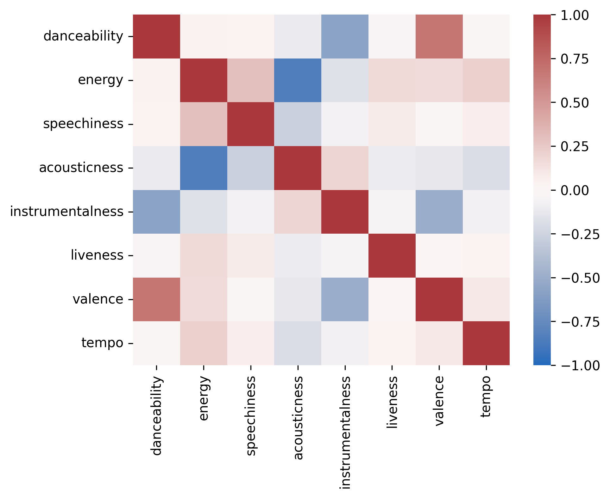
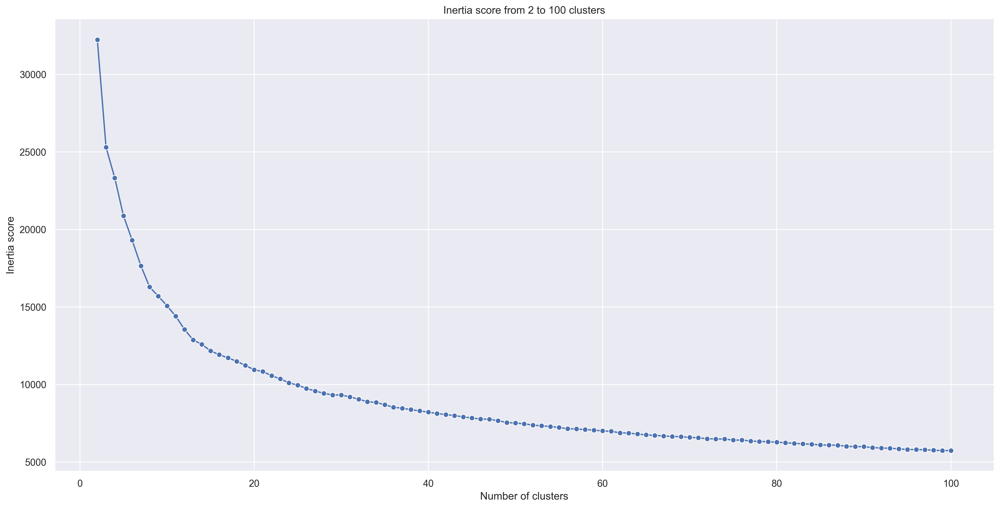
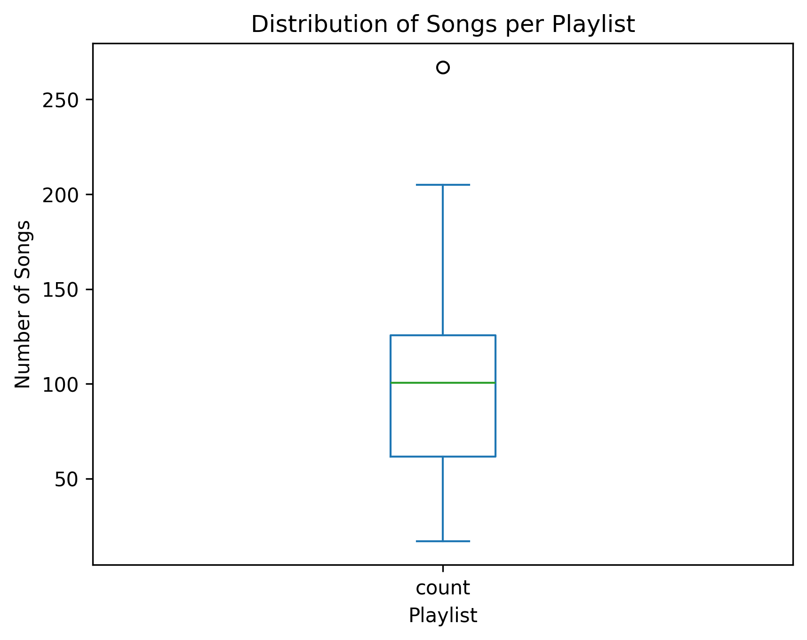
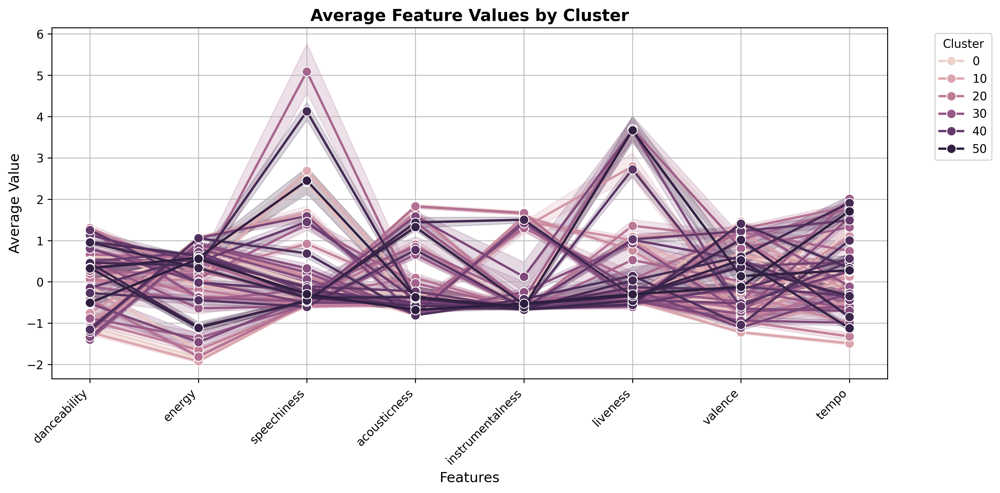
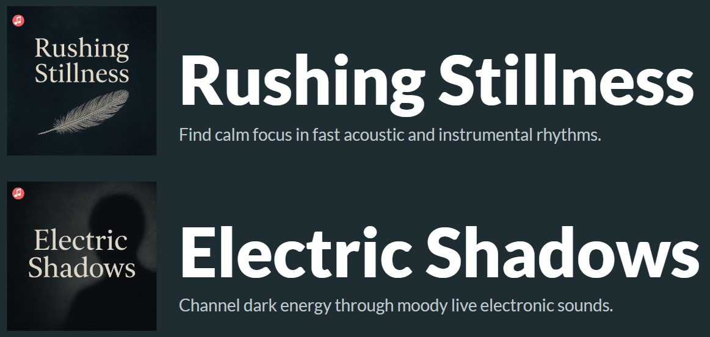

# Moosic: Automatic Playlist Generation Using K-Means Clustering

## Project Overview

Moosic explores whether machine learning can automatically create meaningful playlists by analyzing Spotify's audio features. This project investigates two key questions:

- Can Spotify's audio features identify similar songs?
- Is K-Means clustering an effective method for creating playlists?

## Methodology

### Audio Features

The project leverages Spotify's audio features to analyze songs across multiple dimensions.
Features with high variance and low-to-moderate correlation were chosen to ensure diverse representation:

- **Danceability** - How suitable a track is for dancing
- **Energy** - Intensity and activity measure
- **Acousticness** - Confidence measure of whether the track is acoustic
- **Instrumentalness** - Predicts whether a track contains no vocals
- **Liveness** - Detects presence of an audience in the recording
- **Valence** - Musical positiveness conveyed by a track
- **Tempo** - Overall estimated tempo in BPM
- **Speechiness** - Detects presence of spoken words

### Feature Preprocessing

To ensure all features contribute equally to the clustering algorithm, the data was normalized using a standard scaler:

- Center features around 0 (mean = 0)
- Scale by standard deviation (std = 1)

### K-Means Clustering

The optimal number of clusters was determined to be **52 playlists**, selected based on:
- **Inertia** and **silhouette** scores across 20–100 clusters.  
- Similarity within each playlist  and distinctiveness between different playlists.

## Results
- **52 playlists** were created, each containing on average **100 songs** (range: 21–258).  
- Most playlists represented distinct moods or energy levels (e.g., “calm acoustic,” “energetic dance”), though a few contained outlier songs.  
- Visualizations confirmed well-separated clusters in feature space and strong internal consistency for most groups. 

_Example of a playlist encompassing songs of similar moods._
<video controls src="images/playlist0.mp4" style="width:50%; height:auto;" title="Title"></video>

_Example of a playlist encompassing songs of very different moods._
<video controls src="images/playlist2.mp4" style="width:50%; height:auto;" title="Title"></video>

### Can Spotify's Audio Features Identify Similar Songs?

**Yes, but with limitations.** While the audio features successfully group similar songs together, expert-curated playlists still offer valuable context and unique perspectives that algorithmic approaches may miss.

### Is K-Means a Good Method for Creating Playlists?

**Pros:**
- Fast and easy to implement
- Scalable and cost-effective for large music libraries
- Produces coherent groupings based on audio characteristics

**Cons:**
- Each song can only belong to one playlist (hard clustering)
- Every song must be assigned to a playlist, even outliers
- Difficult to determine the optimal number of playlists
- Challenging to decide which features to prioritize

## Key Takeaways

K-Means clustering serves as a solid starting point for automatic playlist generation, demonstrating that audio features can successfully identify musical similarities. However, the approach could be enhanced through several improvements.

## Future Directions

- **Personalization**: Incorporate user listening habits to create tailored playlist recommendations
- **Enhanced Metadata**: Add automatic suggestions for playlist titles, descriptions, and cover images
- **Interactive Tools**: Develop interfaces allowing music experts to adjust feature weights and refine final playlists
- **Soft Clustering**: Explore algorithms that allow songs to belong to multiple playlists

## AI-Generated Playlist Descriptions

AI-assisted playlist description based on average feature values per cluster is possible as a quick proof of concept for the previuos examples revealed. 

Additional information on included songs might improve the performance.

AI powered tools for playlist creation based on specific prompts as well as on audio features do exist, see e.g., [Groovify](https://groovifi.com/) or [Playlist AI](https://www.playlistai.app/)